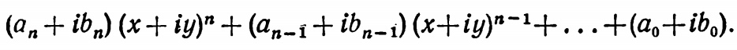
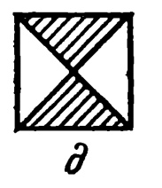
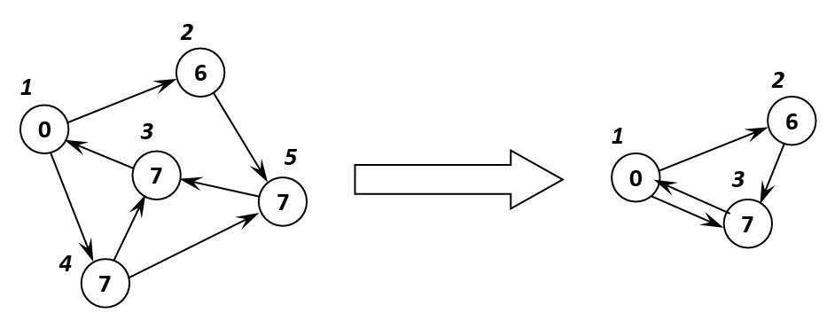

# EducationalPractice

Учебная практика в НИУ ВШЭ (в Перми) студента Пискунова Романа Андреевича

## Оглавление:
1. [Задача 193 на ACMP](#Задание-1)
2. [Задача 896 на ACMP](#Задание-2)
3. [59, рисунок з (Из сборника задач по программированию авторов)](#Задание-3)
4. [438 (Из сборника задач по программированию авторов)](#Задание-4)
5. [692, рисунок д (Из сборника задач по программированию авторов)](#Задание-5)
6. [Построить N элементов последовательности, либо найти первые M ее элементов, большие числа L (в зависимости от того, что выполнится раньше)](#Задание-6)
7. [Сгенерировать все сочетания из N элементов по K без повторений и выписать их в лексикографическом порядке](#Задание-7)
8. [Граф задан матрицей инциденций. Разработать генератор тестов. Найти все его блоки](#Задание-8)
9. [Написать метод подсчета количества элементов двунаправленного списка (рекурсивный и нерекурсивный варианты)](#Задание-9)
10. [Написать метод «стягивания» в одну вершину всех вершин, информационное поле которых содержит заданное значение](#Задание-10)
11. [Разработать шифратор и дешифратор по заданному закону](#Задание-11)
12. [59, рисунок з (Из сборника задач по программированию авторов)](#Задание-12)

## Задание 1:

### Задача:
Определить и вычислить положение и размеры заданных прямоугольников, количество и номера которых задаются пользователем в таблице.

### Входные данные:
* 3 целых числа > 0 : N, M и K.
* N строк по M чисел, каждое из которых соответствует номеру прямоугольника (таблица соответствующая полю N×M клеток).

### Выходные данные:
K строк, каждая из которых описывает соответствующий её номеру прямоугольник, а именно, состоит из координат левого нижнего и правого верхнего углов найденных прямоугольников.

<details>
    <summary><u><b>Программный код 1 задания</b></u></summary>
    
```C#
using System;
using System.IO;

namespace Task_1 {
    public class Program {
        private static void Main(string[] args) {

            StreamWriter writer = new StreamWriter("OUTPUT.txt");
            StreamReader reader = new StreamReader("INPUT.txt");

            string init = "";
            string[] sett = reader.ReadLine().TrimStart(' ').Split(' ');//первая строка
            while (!reader.EndOfStream) init += (reader.ReadLine() + " ");

            init = init.TrimStart(' ');

            string[] pre = init.Split(' ');

            int n = Convert.ToInt32(sett[0]); // количество строк
            int m = Convert.ToInt32(sett[1]); // количество столбцов
            int k = Convert.ToInt32(sett[2]); // количество прямоугольников

            int[] xmin = new int[256]; // координата x левых нижних углов
            int[] ymin = new int[256]; // координата y левых нижних углов

            int[] xmax = new int[256]; // координата x правых верхних углов
            int[] ymax = new int[256]; // координата y правых верхних углов
            
            for (int i = 1; i <= k; i++){
                xmin[i] = m;
                ymin[i] = n;
            }

            int c = 0;
            int d = 0; // для проверки покрытых прямоугольников
            int count = 0; // количество занятых клеток
            for (int y = n; y >= 1; y--) {
                for (int x = 1; x <= m; x++) {
                    int j = Convert.ToInt32(pre[c]); // значение ячейки в матрице
                    
                    if (j > 0) {
                        d = j;
                        count++;
                        if (x < xmin[j]) xmin[j] = x;
                        if (y < ymin[j]) ymin[j] = y;

                        if (x > xmax[j]) xmax[j] = x;
                        if (y > ymax[j]) ymax[j] = y;
                    }
                    c++;
                }
            }

            for (int i = 1; i <= k; i++) {
                // если это единичная клетка, которая покрывает другую
                if (xmin[i] == m && ymin[i] == n && xmax[i] == 0 && ymax[i] == 0 && count == 1) {
                    writer.WriteLine((xmin[d] - 1) + " " + (ymin[d] - 1) + " " + xmax[d] + " " + ymax[d]);
                } else {
                    writer.WriteLine((xmin[i] - 1) + " " + (ymin[i] - 1) + " " + xmax[i] + " " + ymax[i]);
                }
            }

            writer.Close();
            reader.Close();
        }
    }
}
```
</details>

[:arrow_up:Оглавление](#Оглавление)

## Задание 2:

### Задача:
Известно, что на дне рождения может быть либо M, либо N человек, включая самого именинника. На какое минимальное количество частей ему нужно разрезать торт (не обязательно всех равных), чтобы при любом из указанных количеств собравшихся, все съели торт поровну?

### Входные данные:
* 2 натуральных числа : M, N (безразницы в каком порядке).

### Выходные данные:
Искомое минимальное количество кусочков торта (целое число > 0).

<details>
    <summary><u><b>Программный код 2 задания</b></u></summary>
    
```C#
using System;
using System.IO;

namespace Task_2 {
    public class Program {
        private static void Main(string[] args) {
            StreamReader reader = new StreamReader("INPUT.txt");
            StreamWriter writer = new StreamWriter("OUTPUT.txt");
            
            string[] init = reader.ReadToEnd().Split();
            
            int m = Convert.ToInt32(init[0]);
            int n = Convert.ToInt32(init[1]);
            int r = m + n;
            int p = 0;
            while (n > 0) {
                p = m % n;
                m = n;
                n = p;
            }

            writer.WriteLine(r - m);
            reader.Close();
            writer.Close();
        }
    }
}
```
</details>

[:arrow_up:Оглавление](#Оглавление)

## Задание 3:

### Задача:
Определить, принадлежит ли точка вводимыми пользователем координатами x и y заштрихованной области, представленного на рисунке ниже.


### Входные данные:
* 2 вещественных числа: координаты X и Y.

### Выходные данные:
Информация о попадании: либо "Попадает", либо "Не попадает".

<details>
    <summary><u><b>Главное из программного кода к 3 заданию:</b></u></summary>
    
```C#
using System;

namespace Task_3 {
    public class Program {
        private static void Main(string[] args) { MainAction(); }

        /// <summary>
        /// Основная задача программы
        /// </summary>
        private static void MainAction() {

            // ввод координат
            Console.Write("Введите координату X:");
            double x = checkInput();
            Console.Write("Введите координату Y:");
            double y = checkInput();

            // ограничения
            bool y1 = y <= Math.Abs(x);
            bool y2 = x >= -1;
            bool y3 = x <= 1;
            bool y4 = y >= -2;

            // вычисление результата
            if (y1 && y2 && y3 && y4) {
                Console.Write("Точка ");
                Console.ForegroundColor = ConsoleColor.Green;
                Console.Write("входит");
                Console.ResetColor();
                Console.WriteLine(" в заштрихованную область");
            } else {
                Console.Write("Точка ");
                Console.ForegroundColor = ConsoleColor.Red;
                Console.Write("не входит");
                Console.ResetColor();
                Console.WriteLine(" в заштрихованную область");
            }

            // проверка на продолжение
            Console.WriteLine("————————————————————");
            Console.ForegroundColor = ConsoleColor.Blue;
            Console.WriteLine("1. Продолжить\n2. Очистить консоль и продолжить\n3. Закончить\n");
            Console.ResetColor();
            int input = 0;
            bool ok = true;
            Console.ForegroundColor = ConsoleColor.Magenta;
            Console.Write("Команда: ");
            Console.ResetColor();
            do {
                string buf = Console.ReadLine();
                ok = int.TryParse(buf, out input);
                if (input > 3 || input <= 0)
                    ok = false;
                if (!ok) {
                    Console.ForegroundColor = ConsoleColor.DarkRed;
                    Console.WriteLine("Такой команды не существует!");
                    Console.ResetColor();
                    Console.ForegroundColor = ConsoleColor.Magenta;
                    Console.Write("Команда: ");
                    Console.ResetColor();
                }
            } while (!ok);

            switch (input) {
                case 1:
                    MainAction();
                    break;
                case 2:
                    Console.Clear();
                    Console.ForegroundColor = ConsoleColor.Blue;
                    Console.WriteLine("Консоль очищена!");
                    Console.ResetColor();
                    MainAction();
                    break;
                case 3:
                    Environment.Exit(1);
                    break;
                default:
                    // additional feature
                    break;
            }

        }

        /// <summary>
        /// Проверка на ввод координат
        /// </summary>
        /// <returns></returns>
        private static double checkInput() {
            bool ok = true;
            double result;
            do {
                string text = Console.ReadLine();
                ok = double.TryParse(text, out result);
                if (!ok) {
                    Console.ForegroundColor = ConsoleColor.DarkRed;
                    Console.WriteLine("Вы ввели некорректные данные!");
                    Console.Write("Введите действительное число : ");
                    Console.ResetColor();
                }
            } while (!ok);
            return result;
        }

    }
}

```

</details>

[:arrow_up:Оглавление](#Оглавление)

## Задание 4:

### Задача:
Вычислить по схеме Горнера значение многочлена с комплексными коэффициентами.



### Входные данные:
* Числа X, Y, An, Bn, An-1, Bn-1 ..., An, Bn.

### Выходные данные:
Результат арифметических операций с комплексными числами.

<details>
    <summary><u><b>Главное из программного кода к 4 заданию:</b></u></summary>
    
```C#
using System;

namespace Task_4 {
    public class Program {
        private static void Main(string[] args) {
            MainAction();
        }

        private static void MainAction() {

            // ввод
            Console.Write("Введите n:");
            int n = InputInteger(); // степень и нижний индекс

            Console.Write("Введите x:");
            double x = InputDouble(); // действительная часть комплексного числа
            Console.Write("Введите y:");
            double y = InputDouble(); // коэффициент при мнемой части комплексного числа

            Console.ForegroundColor = ConsoleColor.Blue;
            Console.WriteLine("———————————————————————————————————————————————————————————");
            Console.WriteLine("| Введите коэфициенты для i многочлена [ a(n) + b(n)i ] |");
            Console.ResetColor();

            double[] a = new double[n + 1];
            double[] b = new double[n + 1];
            for (int i = n; i >= 0; i--) {
                Console.ForegroundColor = ConsoleColor.Blue;
                Console.WriteLine("———————————————————————————————————————————————————————————");
                Console.ResetColor();
                Console.Write("Введите a({0}) = ", i);
                a[i] = InputDouble();
                Console.Write("Введите b({0}) = ", i);
                b[i] = InputDouble();
            }
            Complex result = new Complex(a[0], b[0]);
            for (int i = n; i > 0; i--) {
                Complex temp = (new Complex(a[i], b[i])) * Complex.Pow(new Complex(x, y), i);
                result += temp;
            }

            Console.ForegroundColor = ConsoleColor.Green;

            // проверки и усовершенствование вывода результата
            if (result.ToString() == "0 + 0i") {
                Console.WriteLine("Ответ: 0");
            }
            if (result.Imaginary > 0) {
                if (result.ToString().Split('+')[0].Trim() == "0" && result.ToString().Split('+')[1].Trim() != "0i") {
                    Console.WriteLine("Ответ: " + result.Imaginary + "i");
                } else if (result.ToString().Split('+')[1].Trim() == "0i" && result.ToString().Split('+')[0].Trim() != "0") {
                    Console.WriteLine("Ответ: " + result.Real);
                } else {
                    Console.WriteLine("Ответ: {0}", result.ToString());
                }
            } else {
                if (result.ToString().Split('-')[0].Trim() == "0" && result.ToString().Split('-')[1].Trim() != "0i") {
                    Console.WriteLine("Ответ: " + result.Imaginary + "i");
                } else if (result.ToString().Split('-')[1].Trim() == "0i" && result.ToString().Split('-')[0].Trim() != "0") {
                    Console.WriteLine("Ответ: " + result.Real);
                } else {
                    Console.WriteLine("Ответ: {0}", result.ToString());
                }
            }
            Console.ResetColor();

            // проверка на продолжение
            Console.WriteLine("————————————————————");
            Console.ForegroundColor = ConsoleColor.Blue;
            Console.WriteLine("1. Продолжить\n2. Очистить консоль и продолжить\n3. Закончить\n");
            Console.ResetColor();
            int input = 0;
            bool ok = true;
            Console.ForegroundColor = ConsoleColor.Magenta;
            Console.Write("Команда: ");
            Console.ResetColor();
            do {
                string buf = Console.ReadLine();
                ok = int.TryParse(buf, out input);
                if (input > 3 || input <= 0)
                    ok = false;
                if (!ok) {
                    Console.ForegroundColor = ConsoleColor.DarkRed;
                    Console.WriteLine("Такой команды не существует!");
                    Console.ResetColor();
                    Console.ForegroundColor = ConsoleColor.Magenta;
                    Console.Write("Команда: ");
                    Console.ResetColor();
                }
            } while (!ok);

            switch (input) {
                case 1:
                    MainAction();
                    break;
                case 2:
                    Console.Clear();
                    Console.ForegroundColor = ConsoleColor.Blue;
                    Console.WriteLine("Консоль очищена!");
                    Console.ResetColor();
                    MainAction();
                    break;
                case 3:
                    Environment.Exit(1);
                    break;
                default:
                    // additional feature
                    break;
            }
        }

        /// <summary>
        /// Ввод действительных чисел
        /// </summary>
        /// <returns></returns>
        private static double InputDouble() {
            bool ok = true;
            double result;
            do {
                string text = Console.ReadLine();
                ok = double.TryParse(text, out result);
                if (!ok) {
                    Console.ForegroundColor = ConsoleColor.DarkRed;
                    Console.WriteLine("Ошибка. Неверный ввод!");
                    Console.Write("Введите повторно : ");
                    Console.ResetColor();
                }
            } while (!ok);
            return result;
        }

        /// <summary>
        /// Ввод натуральных, целых чисел
        /// </summary>
        /// <returns></returns>
        private static int InputInteger() {
            bool ok = true;
            int result;
            do {
                string text = Console.ReadLine();
                ok = int.TryParse(text, out result);
                if (!ok) {
                    Console.ForegroundColor = ConsoleColor.DarkRed;
                    Console.WriteLine("Ошибка. Неверный ввод!");
                    Console.Write("Введите повторно : ");
                    Console.ResetColor();
                }
            } while (!ok);
            return result;
        }

    }

    public class Complex {

        public double Real { get; }
        public double Imaginary { get; }

        public Complex(double real, double imaginary) {
            this.Real = real;
            this.Imaginary = imaginary;
        }

        /// <summary>
        /// Сложение комплексных чисел
        /// </summary>
        /// <param name="c1">Первое слагаемое</param>
        /// <param name="c2">Второе слагаемое</param>
        public static Complex operator +(Complex c1, Complex c2) {
            return new Complex(c1.Real + c2.Real, c1.Imaginary + c2.Imaginary);
        }

        /// <summary>
        /// Разность комплексных чисел
        /// </summary>
        /// <param name="c1">Первое слагаемое</param>
        /// <param name="c2">Второе слагаемое</param>
        public static Complex operator -(Complex c1, Complex c2) {
            return new Complex(c1.Real - c2.Real, c1.Imaginary - c2.Imaginary);
        }

        /// <summary>
        /// Произведение комплексных чисел
        /// </summary>
        /// <param name="c1">Первое слагаемое</param>
        /// <param name="c2">Второе слагаемое</param>
        public static Complex operator *(Complex c1, Complex c2) {
            return new Complex(c1.Real * c2.Real - c1.Imaginary * c2.Imaginary, c2.Real * c1.Imaginary + c1.Real * c2.Imaginary);
        }

        /// <summary>
        /// Произведение действительного и комплексного числа
        /// </summary>
        /// <param name="d"></param>
        /// <param name="a"></param>
        /// <returns></returns>
        public static Complex operator *(double d, Complex a) { return new Complex(d * a.Real, d * a.Imaginary); }

        /// <summary>
        /// Деление комплексных чисел
        /// </summary>
        /// <param name="c1">Первое слагаемое</param>
        /// <param name="c2">Второе слагаемое</param>
        public static Complex operator /(Complex c1, Complex c2) {
            if ((c2.Real == 0.0f) && (c2.Imaginary == 0.0f)) throw new DivideByZeroException("На ноль невозможно делить!");

            double newReal =
            (c1.Real * c2.Real + c1.Imaginary * c2.Imaginary) /
            (c2.Real * c2.Real + c2.Imaginary * c2.Imaginary);

            double newImaginary =
            (c2.Real * c1.Imaginary - c1.Real * c2.Imaginary) /
            (c2.Real * c2.Real + c2.Imaginary * c2.Imaginary);

            return (new Complex(newReal, newImaginary));
        }

        /// <summary>
        /// Возведение комплексного числа в степень
        /// </summary>
        /// <param name="a">Исходное комплексное число</param>
        /// <param name="b">Возводимая степень</param>
        /// <returns></returns>
        public static Complex Pow(Complex a, double b) { return Exp(b * Log(a)); }

        /// <summary>
        /// Модуль комплексного числа
        /// </summary>
        /// <param name="a">Исходное комплексное число</param>
        /// <returns></returns>
        public static double Abs(Complex a) { return Math.Sqrt(a.Imaginary * a.Imaginary + a.Real * a.Real); }

        /// <summary>
        /// Экспонента комплексного числа
        /// </summary>
        /// <param name="a">Исходное комплексное число</param>
        /// <returns></returns>
        public static Complex Exp(Complex a) { return new Complex(Math.Exp(a.Real) * Math.Cos(a.Imaginary), Math.Exp(a.Real) * Math.Sin(a.Imaginary)); }

        /// <summary>
        /// Логорифм комплексного исла
        /// </summary>
        /// <param name="a">Исходное комплексное число</param>
        /// <returns></returns>
        public static Complex Log(Complex a) { return new Complex(Math.Log(Abs(a)), Arg(a)); }

        /// <summary>
        /// Аргумент для подсчёта логарифма комплексного числа
        /// </summary>
        /// <param name="a"></param>
        /// <returns></returns>
        public static double Arg(Complex a) {
            if (a.Real < 0) {
                if (a.Imaginary < 0) return Math.Atan(a.Imaginary / a.Real) - Math.PI;
                else return Math.PI - Math.Atan(-a.Imaginary / a.Real);
            } else return Math.Atan(a.Imaginary / a.Real);
        }

        /// <summary>
        /// Вывод комплекных чисел
        /// </summary>
        public override string ToString() {
            if(Imaginary < 0)
                return string.Format("{0} - {1}i", Real, (-1)*Imaginary);
            else
                return string.Format("{0} + {1}i", Real, Imaginary);
        }

    }

}


```

</details>

[:arrow_up:Оглавление](#Оглавление)

## Задание 5:

### Задача:
Найти наибольшее из значений элементов, расположенных в заштрихованной части матрицы, с заданной размерностью.



### Входные данные:
* Целое число N > 0 (размерность).

### Выходные данные:
Максимальный действительный элемент матрицы.

<details>
    <summary><u><b>Главное из программного кода к 5 заданию:</b></u></summary>
    
```C#
using System;

namespace Task_5 {
    public class Program {

        private static int n; // размерность матрицы

        private static int Middle; // среднее значение (для расчёта)

        private static double[,] matr; // исходная матрица

        private static double Max; // максимальное значение среди элементов марицы,
                                   // которые попадают в заштрихованную область 

        // положение максимального элемента в матрице
        private static int x;
        private static int y;

        // то, какие элементы матрицы попадают в заштрихованную область
        private static int[,] mm;

        private static void Main(string[] args) {
            MainAction();
        }

        /// <summary>
        /// Основные действия программы
        /// </summary>
        private static void MainAction() {
            Console.Write("Размерность матрицы матрицы = ");
            n = InputInteger();

            matr = new double[n, n];

            FillingMatrix(ref matr, n); // сборка матрицы

            Middle = n / 2;

            Max = 0;
            x = 0;
            y = 0;

            mm = new int[n, n];

            // поиск максимального элемента в верхней половине матрицы
            for (int i = 0; i < Middle; i++) {
                for (int j = i; j < n - i; j++) {
                    mm[i, j] = 1;
                    if (matr[i, j] > Max) {
                        Max = matr[i, j];
                        x = i;
                        y = j;
                    }
                }
            }

            // поиск максимального элемента в нижней половине матрицы
            for (int i = Middle; i < n; i++) {
                for (int j = n - 1 - i; j <= i; j++) {
                    mm[i, j] = 1;
                    if (matr[i, j] > Max) {
                        Max = matr[i, j];
                        x = i;
                        y = j;
                    }
                }
            }

            PrintMatrix(matr, mm, n, x, y); // вывод матрицы

            Console.WriteLine("Максимальный элемент ({0}, {1}) = {2}", x, y, Max);

            // проверка на продолжение
            Console.WriteLine("—————————————————————————————————————");
            Console.ForegroundColor = ConsoleColor.Blue;
            Console.WriteLine("1. Продолжить\n2. Очистить консоль и продолжить\n3. Закончить\n");
            Console.ResetColor();
            int input = 0;
            bool ok = true;
            Console.ForegroundColor = ConsoleColor.Magenta;
            Console.Write("Команда: ");
            Console.ResetColor();
            do {
                string buf = Console.ReadLine();
                ok = int.TryParse(buf, out input);
                if (input > 3 || input <= 0)
                    ok = false;
                if (!ok) {
                    Console.ForegroundColor = ConsoleColor.DarkRed;
                    Console.WriteLine("Такой команды не существует!");
                    Console.ResetColor();
                    Console.ForegroundColor = ConsoleColor.Magenta;
                    Console.Write("Команда: ");
                    Console.ResetColor();
                }
            } while (!ok);

            switch (input) {
                case 1:
                    MainAction();
                    break;
                case 2:
                    Console.Clear();
                    Console.ForegroundColor = ConsoleColor.Blue;
                    Console.WriteLine("Консоль очищена!");
                    Console.ResetColor();
                    MainAction();
                    break;
                case 3:
                    Environment.Exit(1);
                    break;
                default:
                    // additional feature
                    break;
            }

        }

        /// <summary>
        /// Вывод матрицы
        /// </summary>
        /// <param name="matr"></param>
        /// <param name="n"></param>
        private static void PrintMatrix(double[,] matr, int[,] mm, int n, int x, int y) {
            string pre = " ";
            for (int i = 0; i < n; i++) {
                pre += "————————";
            }

            Console.WriteLine(pre + "—");
            for (int i = 0; i < n; i++) {
                for (int j = 0; j < n; j++) {
                    if (mm[i,j] == 1) {
                        if (i == x && j == y) {
                            Console.Write("{0,2}", "|");
                            Console.ForegroundColor = ConsoleColor.Red;
                            Console.Write(String.Format("{0,6:0.00}", matr[i, j]));
                            Console.ResetColor();
                        } else {
                            Console.Write("{0,2}", "|");
                            Console.ForegroundColor = ConsoleColor.Blue;
                            Console.Write(String.Format("{0,6:0.00}", matr[i, j]));
                            Console.ResetColor();
                        }
                    } else {
                        Console.Write(String.Format("{0,2}{1,6:0.00}", "|", matr[i, j]));
                    }
                }
                Console.WriteLine(String.Format("{0,2}", "|"));
            }
            Console.WriteLine(pre + "—");
        }


        /// <summary>
        /// Заполнение матрицы
        /// </summary>
        /// <param name="matr">Исходная матрица</param>
        /// <param name="n">Количество строк/столбцов</param>
        /// <param name="type">Тип ввода</param>
        private static void FillingMatrix(ref double[,] matr, int n, int type = 0) {
            Random rnd = new Random();
            if (type == 0) { // рандом
                for (int i = 0; i < n; i++) {
                    for (int j = 0; j < n; j++) {
                        matr[i, j] = Math.Round(rnd.Next(10, 100) + rnd.NextDouble(), 2);
                    }
                }
            } else { // ручками
                for (int i = 0; i < n; i++) {
                    for (int j = 0; j < n; j++) {
                        Console.Write("Введите ({0},{1}) = ", i + 1, j + 1);
                        matr[i, j] = InputDouble();
                    }
                }
            }
        }

        /// <summary>
        /// Ввод натуральных, целых чисел
        /// </summary>
        /// <returns></returns>
        private static int InputInteger() {
            bool ok = true;
            int result;
            do {
                string text = Console.ReadLine();
                ok = int.TryParse(text, out result);
                if (!ok || result <= 0) {
                    ok = false;
                    Console.ForegroundColor = ConsoleColor.DarkRed;
                    Console.WriteLine("Неверный ввод!");
                    Console.Write("Введите целое число > 0 : ");
                    Console.ResetColor();
                }
            } while (!ok);
            return result;
        }

        /// <summary>
        /// Ввод действительных чисел
        /// </summary>
        /// <returns></returns>
        private static double InputDouble() {
            bool ok = true;
            double result;
            do {
                string text = Console.ReadLine();
                ok = double.TryParse(text, out result);
                if (!ok) {
                    ok = false;
                    Console.ForegroundColor = ConsoleColor.DarkRed;
                    Console.WriteLine("Неверный ввод!");
                    Console.Write("Введите действительное число : ");
                    Console.ResetColor();
                }
            } while (!ok);
            return result;
        }

    }

}


```

</details>

[:arrow_up:Оглавление](#Оглавление)

## Задание 6:

### Задача:
Построить последовательность чисел Aк = (7/3* Aк–1 + Aк-2 ) /2 * ак–3. Построить N элементов последовательности, либо найти первые M ее элементов, большие числа L (в зависимости от того, что выполнится раньше).

### Входные данные:
* 3 целых числа > 0 : М, N, L.
* Действительные числа: A1, A2, A3.

### Выходные данные:
Последовательность и причина остановки.

<details>
    <summary><u><b>Главное из программного кода к 6 заданию:</b></u></summary>
    
```C#
using System;
using System.Collections.Generic;
using System.Diagnostics;
using System.Linq;
using System.Text;
using System.Threading;
using System.Threading.Tasks;

namespace Task_6 {
    public class Program {

        // для проверки скорости выполнения операций
        private static Stopwatch one_case = new Stopwatch();
        private static Stopwatch two_case = new Stopwatch();
        
        private static int M, N; // ограничители по длине последовательности
        private static double L; // ограничитель для M

        private static double[] sequence; // итоговая последовательность

        private static void Main(string[] args) {
            InitVars();
            if (!MainAction()) {
                Console.Clear();
                Console.ForegroundColor = ConsoleColor.Blue;
                Console.WriteLine("Лимит времени выполнения превышен (2 сек.)\nЗадайте не такие большие числа!");
                Console.ResetColor();
                Console.WriteLine("————————————————————");
                InitVars();
            }

            // проверка на продолжение
            Console.WriteLine("————————————————————");
            Console.ForegroundColor = ConsoleColor.Blue;
            Console.WriteLine("1. Продолжить\n2. Очистить консоль и продолжить\n3. Закончить\n");
            Console.ResetColor();
            int input = 0;
            bool ok = true;
            Console.ForegroundColor = ConsoleColor.Magenta;
            Console.Write("Команда: ");
            Console.ResetColor();
            do {
                string buf = Console.ReadLine();
                ok = int.TryParse(buf, out input);
                if (input > 3 || input <= 0)
                    ok = false;
                if (!ok) {
                    Console.ForegroundColor = ConsoleColor.DarkRed;
                    Console.WriteLine("Такой команды не существует!");
                    Console.ResetColor();
                    Console.ForegroundColor = ConsoleColor.Magenta;
                    Console.Write("Команда: ");
                    Console.ResetColor();
                }
            } while (!ok);

            switch (input) {
                case 1:
                    MainAction();
                    break;
                case 2:
                    Console.Clear();
                    Console.ForegroundColor = ConsoleColor.Blue;
                    Console.WriteLine("Консоль очищена!");
                    Console.ResetColor();
                    MainAction();
                    break;
                case 3:
                    Environment.Exit(1);
                    break;
                default:
                    // additional feature
                    break;
            }

            Console.ReadKey();
        }

        private static void InitVars() {
            InputIntegerForN(ref N, "Введите количество элементов N : ");
            sequence = new double[N];
            InputDouble(ref sequence[0], "Введите a1: ");
            InputDouble(ref sequence[1], "Введите a2: ");
            InputDouble(ref sequence[2], "Введите a3: ");

            InputIntegerForM(ref M, "Введите количество элементов M : ");
            InputDouble(ref L, "Введите значение L (минимум для M): ");
        }

        /// <summary>
        /// Основные действия в программе
        /// </summary>
        private static bool MainAction() {

            bool result = true;

            // подсчёт времени на N членов последовательности
            one_case.Start();
            DateTime startTime_n = DateTime.Now; // для ограничения по времени выполнения
            for (int i = 3; i < N; i++) {
                if (DateTime.Now.Subtract(startTime_n) >= new TimeSpan(0, 0, 0, 0, 2000)) {
                    result = false;
                    break;
                }
                sequence[i] = Math.Round(getSequenceValue(sequence, i), 2);
            }
            one_case.Stop();

            // подсчёт времени на M членов последовательности
            two_case.Start();
            DateTime startTime_m = DateTime.Now; // для ограничения по времени выполнения
            int c = 0;
            int d = 0;
            while (c != M) {
                if (DateTime.Now.Subtract(startTime_n) >= new TimeSpan(0, 0, 0, 0, 2000)) {
                    result = false;
                    break;
                }
                if (getSequenceValue(sequence, d) > L) {
                    if (c <= M)
                        c++;
                    else
                        break;
                }
                d++;
            }
            two_case.Stop();

            if(result == true) {
                // если поиск M членов последователности быстрее
                if (two_case.ElapsedMilliseconds < one_case.ElapsedMilliseconds) {
                    sequence = SearchM();
                    Console.WriteLine("Поиск M элем. послед. быстрее на {0} миллисекунд(-у)", one_case.ElapsedMilliseconds - two_case.ElapsedMilliseconds);
                } else { // если подсчёт N членов последовательности быстрее
                    Console.WriteLine("Вычисление N элем. послед. быстрее на {0} миллисекунд(-у)", two_case.ElapsedMilliseconds - one_case.ElapsedMilliseconds);
                }

                // вывод последовательности
                for (int i = 0; i < sequence.Length; i++)
                    Console.WriteLine("{0} эл. послед. = {1}", i + 1, sequence[i]);
            }
            
            return result;
        }

        /// <summary>
        /// Поиск первых M членов последовательности, которые больше L
        /// </summary>
        /// <returns></returns>
        private static double[] SearchM() {
            double[] second = new double[3 + M];
            second[0] = sequence[0];
            second[1] = sequence[1];
            second[2] = sequence[2];
            int c = 0; // проверка для M
            int d = 0; // счётчик 
            while (c != M) {
                double temp = getSequenceValue(sequence, d);
                if (temp > L) {
                    if (c <= M) {
                        second[c + 3] = temp;
                        c++;
                    } else break;
                }
                d++;
            }
            return second;
        }

        /// <summary>
        /// Вычисление последовательности рекурсией
        /// </summary>
        /// <param name="seq">Последовательность</param>
        /// <param name="input">Номер элемента в последовательности</param>
        /// <returns></returns>
        private static double getSequenceValue(double[] seq, int input) {
            if (input == 0)
                return seq[0];
            else if (input == 1)
                return seq[1];
            else if (input == 2)
                return seq[2];
            else
                return ((7/3)*getSequenceValue(seq, input-1) + getSequenceValue(seq, input - 2))/(2* getSequenceValue(seq, input - 3));
        }

        /// <summary>
        /// Воод не целых данных
        /// </summary>
        /// <param name="init">куда будет записываться</param>
        /// <param name="splash">Вступление (текст)</param>
        private static void InputDouble(ref double init, string splash) {
            bool ok = true;
            Console.Write(splash);
            do {
                string buf = Console.ReadLine();
                ok = double.TryParse(buf, out init);
                if (!ok) {
                    Console.ForegroundColor = ConsoleColor.DarkRed;
                    Console.Write("Неверный ввод!\nВведите вещественное число : ");
                    Console.ResetColor();
                }
            } while (!ok);
        }

        /// <summary>
        /// Воод числа N
        /// </summary>
        /// <param name="init">куда будет записываться</param>
        /// <param name="splash">Вступление (текст)</param>
        private static void InputIntegerForN(ref int init, string splash) {
            bool ok = true;
            Console.Write(splash);
            do {
                string buf = Console.ReadLine();
                ok = int.TryParse(buf, out init);
                if (init <= 2) ok = false;
                if (!ok) {
                    Console.ForegroundColor = ConsoleColor.DarkRed;
                    Console.Write("Неверный ввод!\nВведите целое число > 2 : ");
                    Console.ResetColor();
                }
            } while (!ok);
        }

        /// <summary>
        /// Ввод числа M
        /// </summary>
        /// <param name="init">куда будет записываться</param>
        /// <param name="splash">Вступление (текст)</param>
        private static void InputIntegerForM(ref int init, string splash) {
            bool ok = true;
            Console.Write(splash);
            do {
                string buf = Console.ReadLine();
                ok = int.TryParse(buf, out init);
                if (init <= 0)
                    ok = false;
                if (!ok) {
                    Console.ForegroundColor = ConsoleColor.DarkRed;
                    Console.Write("Неверный ввод!\nВведите целое число > 0 : ");
                    Console.ResetColor();
                }
            } while (!ok);
        }

    }
}


```

</details>

[:arrow_up:Оглавление](#Оглавление)

## Задание 7:

### Задача:
Сгенерировать все сочетания из N элементов по K без повторений и выписать их в лексикографическом порядке.

### Входные данные:
* Целые числа > 0: M и N.

### Выходные данные:
Список сочетаний.

<details>
    <summary><u><b>Главное из программного кода к 7 заданию:</b></u></summary>
    
```C#
using System;
using System.Collections.Generic;
using System.Linq;
using System.Text;
using System.Threading.Tasks;
        
namespace Task_7 {
    public class Program {

        private static int print_num = 1; // для вывода номера сочетания
        private static int[] seq; // все возможные сочетания
        private static int n = 0; // алфавит от 1 до n
        private static int k = 0; // длина сочетаний

        private static void Main(string[] args) {
            MainAction();
        }

        /// <summary>
        /// Основные действия программы
        /// </summary>
        private static void MainAction() {
            print_num = 1;
            n = 0;
            k = 0;

            InputInteger(ref n, "Введите N (алфивит): ");
            InputInteger(ref k, "Введите K (длина каждого сочетания): ");

            // начальное заполнение массива от 1 до n
            seq = new int[n];
            for (int i = 0; i < n; i++) {
                seq[i] = i + 1;
            }

            if (n >= k) {
                Print(seq, k);// + если n = k
                while (NextSet(seq, n, k))
                    Print(seq, k);
            } else {
                Console.WriteLine("Таких сочетаний нет!");
            }

            // проверка на продолжение
            Console.WriteLine("————————————————————");
            Console.ForegroundColor = ConsoleColor.Blue;
            Console.WriteLine("1. Продолжить\n2. Очистить консоль и продолжить\n3. Закончить\n");
            Console.ResetColor();
            int input = 0;
            bool ok = true;
            Console.ForegroundColor = ConsoleColor.Magenta;
            Console.Write("Команда: ");
            Console.ResetColor();
            do {
                string buf = Console.ReadLine();
                ok = int.TryParse(buf, out input);
                if (input > 3 || input <= 0)
                    ok = false;
                if (!ok) {
                    Console.ForegroundColor = ConsoleColor.DarkRed;
                    Console.WriteLine("Такой команды не существует!");
                    Console.ResetColor();
                    Console.ForegroundColor = ConsoleColor.Magenta;
                    Console.Write("Команда: ");
                    Console.ResetColor();
                }
            } while (!ok);

            switch (input) {
                case 1:
                    MainAction();
                    break;
                case 2:
                    Console.Clear();
                    Console.ForegroundColor = ConsoleColor.Blue;
                    Console.WriteLine("Консоль очищена!");
                    Console.ResetColor();
                    MainAction();
                    break;
                case 3:
                    Environment.Exit(1);
                    break;
                default:
                    // additional feature
                    break;
            }

        }

        /// <summary>
        /// Проверка того, подходит ли следующее сочетание
        /// </summary>
        /// <param name="a"></param>
        /// <param name="n"></param>
        /// <param name="k"></param>
        /// <returns></returns>
        private static bool NextSet(int[] a, int n, int k) {
            for (int i = k - 1; i >= 0; --i) {
                if (a[i] < n - k + i + 1) {
                    ++a[i];
                    for (int j = i + 1; j < k; ++j) {
                        a[j] = a[j - 1] + 1;
                    }
                    return true;
                }
            }
            return false;
        }
        
        /// <summary>
        /// Вывод сочетаний
        /// </summary>
        /// <param name="a"></param>
        /// <param name="k"></param>
        private static void Print(int[] a, int k) {
            Console.Write("{0,-2}", print_num++);
            Console.Write("{0,1}", ": ");
            for (int i = 0; i < k; i++)  Console.Write(a[i] + " ");
            Console.Write("\n");
        }
        
        /// <summary>
        /// Воод целых данных
        /// </summary>
        /// <param name="init">В какую переменную должно занесить число</param>
        /// <param name="splash">Вступительный текст</param>
        private static void InputInteger(ref int init, string splash) {
            bool ok = true;
            Console.Write(splash);
            do {
                string buf = Console.ReadLine();
                ok = int.TryParse(buf, out init);
                if (init <= 0)
                    ok = false;
                if (!ok) {
                    Console.ForegroundColor = ConsoleColor.DarkRed;
                    Console.Write("Неверный ввод!\nВведите целое число > 0 : ");
                    Console.ResetColor();
                }
            } while (!ok);
        }
    }

}


```

</details>

[:arrow_up:Оглавление](#Оглавление)

## Задание 8:

### Задача:
Граф задан матрицей инциденций. Разработать генератор тестов. Найти все его блоки.

### Входные данные:
* Матрица инциденций, содержащая только 0 и 1.

### Выходные данные:
Информация о блоках, содержащихся в заданном графе.

[:arrow_up:Оглавление](#Оглавление)

## Задание 9:

### Задача:
Реализовать двунаправленный список. Написать метод подсчета количества его элементов (рекурсивный и нерекурсивный варианты).

### Входные данные:
* Двунаправленный список (для пункта в меню "Ввод с клавиатуры")

### Выходные данные:
Целое исло > 0.

<details>
    <summary><u><b>Главное из программного кода к 9 задание:</b></u></summary>
    
```C#
using System;
using System.Collections.Generic;
using System.Linq;
using System.Text;
using System.Threading.Tasks;
        
namespace Task_7 {
    public class Program {

        private static int print_num = 1; // для вывода номера сочетания
        private static int[] seq; // все возможные сочетания
        private static int n = 0; // алфавит от 1 до n
        private static int k = 0; // длина сочетаний

        private static void Main(string[] args) {
            MainAction();
        }

        /// <summary>
        /// Основные действия программы
        /// </summary>
        private static void MainAction() {
            print_num = 1;
            n = 0;
            k = 0;

            InputInteger(ref n, "Введите N (алфивит): ");
            InputInteger(ref k, "Введите K (длина каждого сочетания): ");

            // начальное заполнение массива от 1 до n
            seq = new int[n];
            for (int i = 0; i < n; i++) {
                seq[i] = i + 1;
            }

            if (n >= k) {
                Print(seq, k);// + если n = k
                while (NextSet(seq, n, k))
                    Print(seq, k);
            } else {
                Console.WriteLine("Таких сочетаний нет!");
            }

            // проверка на продолжение
            Console.WriteLine("————————————————————");
            Console.ForegroundColor = ConsoleColor.Blue;
            Console.WriteLine("1. Продолжить\n2. Очистить консоль и продолжить\n3. Закончить\n");
            Console.ResetColor();
            int input = 0;
            bool ok = true;
            Console.ForegroundColor = ConsoleColor.Magenta;
            Console.Write("Команда: ");
            Console.ResetColor();
            do {
                string buf = Console.ReadLine();
                ok = int.TryParse(buf, out input);
                if (input > 3 || input <= 0)
                    ok = false;
                if (!ok) {
                    Console.ForegroundColor = ConsoleColor.DarkRed;
                    Console.WriteLine("Такой команды не существует!");
                    Console.ResetColor();
                    Console.ForegroundColor = ConsoleColor.Magenta;
                    Console.Write("Команда: ");
                    Console.ResetColor();
                }
            } while (!ok);

            switch (input) {
                case 1:
                    MainAction();
                    break;
                case 2:
                    Console.Clear();
                    Console.ForegroundColor = ConsoleColor.Blue;
                    Console.WriteLine("Консоль очищена!");
                    Console.ResetColor();
                    MainAction();
                    break;
                case 3:
                    Environment.Exit(1);
                    break;
                default:
                    // additional feature
                    break;
            }

        }

        /// <summary>
        /// Проверка того, подходит ли следующее сочетание
        /// </summary>
        /// <param name="a"></param>
        /// <param name="n"></param>
        /// <param name="k"></param>
        /// <returns></returns>
        private static bool NextSet(int[] a, int n, int k) {
            for (int i = k - 1; i >= 0; --i) {
                if (a[i] < n - k + i + 1) {
                    ++a[i];
                    for (int j = i + 1; j < k; ++j) {
                        a[j] = a[j - 1] + 1;
                    }
                    return true;
                }
            }
            return false;
        }
        
        /// <summary>
        /// Вывод сочетаний
        /// </summary>
        /// <param name="a"></param>
        /// <param name="k"></param>
        private static void Print(int[] a, int k) {
            Console.Write("{0,-2}", print_num++);
            Console.Write("{0,1}", ": ");
            for (int i = 0; i < k; i++)  Console.Write(a[i] + " ");
            Console.Write("\n");
        }
        
        /// <summary>
        /// Воод целых данных
        /// </summary>
        /// <param name="init">В какую переменную должно занесить число</param>
        /// <param name="splash">Вступительный текст</param>
        private static void InputInteger(ref int init, string splash) {
            bool ok = true;
            Console.Write(splash);
            do {
                string buf = Console.ReadLine();
                ok = int.TryParse(buf, out init);
                if (init <= 0)
                    ok = false;
                if (!ok) {
                    Console.ForegroundColor = ConsoleColor.DarkRed;
                    Console.Write("Неверный ввод!\nВведите целое число > 0 : ");
                    Console.ResetColor();
                }
            } while (!ok);
        }
    }

}


```

</details>

[:arrow_up:Оглавление](#Оглавление)

## Задание 10

### Задача:
Написать метод «стягивания» в одну вершину всех вершин, информационное поле которых содержит заданное значение.



### Входные данные:
* Граф задан матрицей смежности, содержащей только 0 и 1.

### Выходные данные:
Матрица с изменениями.

<details>
    <summary><u><b>Главное из программного кода к 10 заданию:</b></u></summary>
    
```C#
using System;
using System.Collections.Generic;
using System.Linq;
using System.Text;
using System.Threading.Tasks;

namespace Task_10 {
    class Program {
        static void Main(string[] args) {

            Graph Graph = Graph.ReadGraph(); // Чтение графа из файла

            // Если удалось прочитать граф
            if (Graph != null) {
                int Value; // Значение, записанное в вершинах, которые надо стянуть
                
                bool ok;

                // Ввод значения, которое хотим стянуть
                do {
                    Console.Write("Введите значение, записанное в вершинах, которые надо стянуть: ");
                    ok = Int32.TryParse(Console.ReadLine(), out Value);
                    if (!ok)
                        Console.WriteLine("В вершинах записаны целые числа! Повторите ввод: ");
                } while (!ok);

                // Стягиваем вершины с указанным значением
                Graph.Contraction(Value);

                //// Запись полученного графа в файл
                Graph.WriteGraph();
            }

            Console.WriteLine("Нажмите любую клавишу...");
            Console.ReadKey();
        }
    }
}


```

</details>

[:arrow_up:Оглавление](#Оглавление)

## Задание 11

### Задача:
Требуется написать шифратор и дешифратор для последовательности нулей и единиц таким образом, что при шифровании, если предыдущий элемент равен текущему, то ставится 1, в противном случае ставится 0.

### Входные данные:
* Пследовательность целых чисел 0 или 1.

### Выходные данные:
Именённая последовательность целых чисел 0 или 1.

<details>
    <summary><u><b>Главное из программного кода к 11 заданию:</b></u></summary> з
    
```C#
using System;
using System.IO;

namespace Task_11 {
    class Program {

        static string InputMessage = "";
        static string OutputMessage;

        static StreamWriter OutputFile;

        static int able = 0;

        static void Main(string[] args) {
            do {
                if (able == 0) {
                    Console.ForegroundColor = ConsoleColor.Green;
                    Console.WriteLine("МЕНЮ");
                    Console.ResetColor();
                    FirstMenu();
                } else if (able == 1) {
                    WorkWithMessage();
                }
            } while (true);
        }

        /// <summary>
        /// Ввод сообщения, с которым нужно работать
        /// </summary>
        /// <returns></returns>
        static string ConsoleInput() {
            string res;
            
            bool ok = true;
            do {
                Console.WriteLine("Введите сообщение, которое хотите обработать: ");
                res = Console.ReadLine();
                for (int i = 0; i < res.Length; i++) {
                    if (res[i] != '0' && res[i] != '1') {
                        ok = false;
                        break;
                    } else {
                        ok = true;
                    }
                }
                if (!ok)
                    Console.WriteLine("Сообщение должно содержать только 0 и 1.");
            } while (!ok);

            return res;
        }

        /// <summary>
        /// Ввод сообщения из файла
        /// </summary>
        /// <returns></returns>
        static string FileInput() {
            StreamReader InputFile;
            string Result;

            try {
                InputFile = new StreamReader("input.txt");
                Result = InputFile.ReadLine();
            } catch (FileNotFoundException e) {
                Console.WriteLine("Файла \"input.txt\" не обнаружено, введите выражение вручную: ");
                Result = ConsoleInput();
            }

            return Result;
        }

        /// <summary>
        /// Шифрование сообщения
        /// </summary>
        /// <param name="Input">Исходное сообщение</param>
        /// <returns></returns>
        static string EncryptMessage(string Input) {
            string Output = "";
            Output += Input[0];
            for (int i = 1; i < Input.Length; i++) {
                if (Input[i] == Input[i - 1])
                    Output += 1;
                else
                    Output += 0;
            }
            return Output;
        }

        /// <summary>
        /// Расшифровка сообщения
        /// </summary>
        /// <param name="Input">Зашифрованное сообщение</param>
        /// <returns></returns>
        static string DecryptMessage(string Input) {
            string Output = "";
            Output += Input[0];
            for (int i = 1; i < Input.Length; i++) {
                if (Input[i] == '1') {
                    Output += Output[i - 1];
                } else {
                    if (Input[i - 1] == '1')
                        Output += 0;
                    else
                        Output += 1;
                }
            }
            return Output;
        }

        static void WorkWithMessage() {
            Console.WriteLine("1. Зашифровать сообщение\n2. Расшифровать сообщение\n3. Назад\n4. Выйти");
            int cmd = getSettingInput(4);
            switch (cmd) {
                case 1: // зашифровать сообщение 
                    OutputMessage = EncryptMessage(InputMessage);
                    Console.ForegroundColor = ConsoleColor.Blue;
                    Console.WriteLine("Зашифрованное сообщение: {0}", OutputMessage);
                    Console.ResetColor();
                    WriteToFile(OutputMessage);
                    break;
                case 2: // расшифровать сообщение
                    OutputMessage = DecryptMessage(InputMessage);
                    Console.ForegroundColor = ConsoleColor.Blue;
                    Console.WriteLine("Расшифрованное сообщение: {0}", OutputMessage);
                    Console.ResetColor();
                    WriteToFile(OutputMessage);
                    break;
                case 3: // кнопка "Назад"
                    Console.Clear();
                    able = 0;
                    break;
                case 4: // выход из консольки
                    Environment.Exit(0);
                    break;
                default:
                    break;
            }

        }

        /// <summary>
        /// Запись результата в файл
        /// </summary>
        /// <param name="Message"></param>
        static void WriteToFile(string Message) {
            Console.WriteLine("Записать в файл? ");
            Console.WriteLine("1. Да\n2. Нет");
            int cmd = getSettingInput(2);
            switch (cmd) {
                case 1: // запись в файл
                    try {
                        OutputFile = new StreamWriter("output.txt");
                        OutputFile.WriteLine(OutputMessage);
                        OutputFile.Close();
                    } catch (FileNotFoundException) {
                        File.Create("output.txt");
                        OutputFile = new StreamWriter("output.txt");
                        OutputFile.WriteLine(OutputMessage);
                        OutputFile.Close();
                    }
                    Console.ForegroundColor = ConsoleColor.Blue;
                    Console.WriteLine("Результат записан!");
                    Console.ResetColor();
                    break;
                case 2:
                    able = 0;
                    FirstMenu();
                    break;
            }
        }

        /// <summary>
        /// Главное меню
        /// </summary>
        static void FirstMenu() {
            Console.WriteLine("1. Ввести выражение с клавиатуры\n2. Ввести выражение из файла\n3. Очистить консоль\n4. Выйти");

            Console.ForegroundColor = ConsoleColor.Magenta;
            Console.Write("Команда: ");
            Console.ResetColor();
            int cmd = getSettingInput(4);

            switch (cmd) {
                case 1: // ввод с клавиатуры 
                    able = 1;
                    InputMessage = ConsoleInput();
                    WorkWithMessage();
                    break;
                case 2: // ввод из файла
                    able = 1;
                    InputMessage = FileInput();
                    break;
                case 3: // кнопка "Назад" 
                    Console.Clear();
                    able = 0;
                    break;
                case 4: // выход из консольки
                    Environment.Exit(0);
                    break;
                default:
                    break;
            }
        }
        
        /// <summary>
        /// Ввод для менюшки с ограничением ввода
        /// </summary>
        /// <param name="n">Огрничение по вводу</param>
        /// <returns></returns>
        private static int getSettingInput(int n) {
            bool ok = true;
            int temp = 0;
            do {
                string buf = Console.ReadLine();
                ok = int.TryParse(buf, out temp);
                if (!ok || temp < 0 || temp > n) {
                    ok = false;
                    Console.ForegroundColor = ConsoleColor.Magenta;
                    Console.Write("Неверный воод! Введите целое число > 0 : ");
                    Console.ResetColor();
                }
            } while (!ok);
            return temp;
        }

        /// <summary>
        /// Обычный ввод для менюшки (> 0)
        /// </summary>
        /// <returns></returns>
        private static int getSimpleInput() {
            bool ok = true;
            int temp = 0;
            do {
                string buf = Console.ReadLine();
                ok = int.TryParse(buf, out temp);
                if (!ok || temp < 0) {
                    ok = false;
                    Console.ForegroundColor = ConsoleColor.Magenta;
                    Console.Write("Неверный ввод! Введите корректные данные: ");
                    Console.ResetColor();
                }
            } while (!ok);
            return temp;
        }
    }
}


```

</details>

[:arrow_up:Оглавление](#Оглавление)

## Задание 12

### Задача:
Требуется реализовать программу, сравнивающую два различных способа сортировки: сортировка Шелла и быстрая сортировка. В сравнении участвуют три одномерных массива, содержащие N элементов, но по-разному выстроенных, т.е., чтобы первый массив был упорядоченным по возрастанию, второй упорядоченным по убыванию, а третий не упорядоченным.

### Входные данные:
* Целое число N > 0 (размерность массивов)

### Выходные данные:
Список сочетаний.

<details>
    <summary><u><b>Главное из программного кода к 12 заданию:</b></u></summary>
    
```C#
using System;

namespace Task_12 {
    class Program {
        static void Main(string[] args) {

            Console.Write("Какой размерностью будет массив: ");
            int size = getSimpleInput();// разрмерность массивов
            Collections col = new Collections(size);
            
            int[] ArrInc = col.GetArray(1); // упорядоченный по возрастанию массив
            int[] ArrDec = col.GetArray(-1); // упорядоченный по убыванию массив
            int[] ArrUns = col.GetArray(0); // неупорядоченный массив

            Console.WriteLine("Упорядоченный по возрастанию массив:");
            Collections.PrintArray(ArrInc);
            Console.WriteLine("Упорядоченный по убыванию массив:");
            Collections.PrintArray(ArrDec);
            Console.WriteLine("Неупорядоченный массив:");
            Collections.PrintArray(ArrUns);

            Console.WriteLine("Сортировка Шелла:");
            Console.WriteLine("Результат сортировки упорядоченного по возрастанию массива сортировкой Шелла:");
            Collections.SortShell(ref ArrInc);

            Console.WriteLine("Результат сортировки упорядоченного по убыванию массива сортировкой Шелла:");
            Collections.SortShell(ref ArrDec);

            Console.WriteLine("Результат сортировки неупорядоченного массива сортировкой Шелла:");
            Collections.SortShell(ref ArrUns);

            // Восстановление массивов
            ArrInc = col.GetArray(1);
            ArrDec = col.GetArray(-1);
            ArrUns = col.GetArray(0);

            Console.WriteLine("Быстрая сортировка:");

            // Счетчики сравнений и перестановок
            int ComparesCounter = 0, ReplacesCounter = 0;

            Console.WriteLine("Результат сортировки упорядоченного по возрастанию массива быстрой сортировкой:");
            Collections.QuickSort(ref ArrInc, 0, ArrInc.Length - 1, ref ComparesCounter, ref ReplacesCounter);
            Collections.PrintArray(ArrInc);
            Console.WriteLine("При сортировке массива было выполнено {0} сравнений(-я) и {1} перестановок(-вки).\n", ComparesCounter, ReplacesCounter);
            ComparesCounter = ReplacesCounter = 0;

            Console.WriteLine("Результат сортировки упорядоченного по убыванию массива быстрой сортировкой:");
            Collections.QuickSort(ref ArrDec, 0, ArrInc.Length - 1, ref ComparesCounter, ref ReplacesCounter);
            Collections.PrintArray(ArrDec);
            Console.WriteLine("При сортировке массива было выполнено {0} сравнений(-я) и {1} перестановок(-вки).\n", ComparesCounter, ReplacesCounter);
            ComparesCounter = ReplacesCounter = 0;

            Console.WriteLine("Результат сортировки неупорядоченного массива быстрой сортировкой:");
            Collections.QuickSort(ref ArrUns, 0, ArrInc.Length - 1, ref ComparesCounter, ref ReplacesCounter);
            Collections.PrintArray(ArrUns);
            Console.WriteLine("При сортировке массива было выполнено {0} сравнений(-я) и {1} перестановок(-вки).\n", ComparesCounter, ReplacesCounter);

            Console.ReadKey();
        }

        /// <summary>
        /// Ввод для менюшки с ограничением ввода
        /// </summary>
        /// <param name="n">Огрничение по вводу</param>
        /// <returns></returns>
        private static int getSettingInput(int n) {
            bool ok = true;
            int temp = 0;
            do {
                string buf = Console.ReadLine();
                ok = int.TryParse(buf, out temp);
                if (!ok || temp < 0 || temp > n) {
                    ok = false;
                    Console.ForegroundColor = ConsoleColor.Magenta;
                    Console.Write("Неверный ввод! Введие целое число > {0}: ", n);
                    Console.ResetColor();
                }
            } while (!ok);
            return temp;
        }

        /// <summary>
        /// Обычный ввод для менюшки (> 0)
        /// </summary>
        /// <returns></returns>
        private static int getSimpleInput() {
            bool ok = true;
            int temp = 0;
            do {
                string buf = Console.ReadLine();
                ok = int.TryParse(buf, out temp);
                if (!ok || temp < 0) {
                    ok = false;
                    Console.ForegroundColor = ConsoleColor.Magenta;
                    Console.Write("Неверный ввод! Введите целое число > 0: ");
                    Console.ResetColor();
                }
            } while (!ok);
            return temp;
        }

    }
}


```

</details>

[:arrow_up:Оглавление](#Оглавление)

